<div align="center">


</div>

---

```bash
$ whoami
```

```
Mayank Singh — MCA'26
Cloud & DevOps Engineer · Android Developer
Building reliable infrastructure and shipping clean software.
```

---

```bash
$ man mayank
```

```
NAME
       mayank-singh — cloud & devops engineer, android developer

SYNOPSIS
       mayank [--build] [--deploy] [--automate] [--ship]

DESCRIPTION
       An engineer who started with Android and moved into cloud
       infrastructure. Writes code that runs on devices and builds
       systems that keep it running in production.

       Comfortable in the terminal. Thinks in pipelines.
       Ships things that work.

       · Designs and deploys containerized workloads on AWS
         using Docker, ECS and CloudFormation.

       · Builds CI/CD pipelines that take code from a git push
         to a live environment without manual intervention.

       · Automates infrastructure and workflows with Python,
         Boto3 and shell scripts.

       · Background in Android — Java, Kotlin, Jetpack Compose —
         which means the code running on the infrastructure
         was also written by the same hands.

OPTIONS
       --build       Android apps, Docker images, cloud stacks
       --deploy      AWS ECS, CloudFormation, Jenkins CI/CD
       --automate    Boto3, Playwright, Selenium, shell scripts
       --ship        commits, pushes, pipelines, done

EXIT STATUS
       Always 0. Gets things done.
```

---

```bash
$ cat about.me
```

```
I work at the intersection of software engineering and cloud infrastructure.

My foundation is in Android development — building production apps with
Java, Kotlin and Jetpack Compose. I am now focused on the infrastructure
side: automating deployments, containerizing workloads, and designing
systems that scale without breaking.

Outside of tech — I read a lot. Geopolitics, history, books about
extraordinary things humans have pulled off. I play cricket. And I am
learning to ride horses, because why not.
```

---

```bash
$ cat stack.json
```

```json
{
  "infrastructure"  : ["AWS", "Terraform", "Nginx"],
  "cloud_hosting"   : ["Render", "GitHub Pages"],
  "systems"         : ["Linux", "Bash"],
  "containers_cicd" : ["Docker", "Jenkins", "GitHub Actions"],
  "languages"       : ["Python", "Java", "JavaScript"],
  "automation"      : ["Boto3", "Selenium", "Playwright"],
  "api_testing"     : ["Postman", "REST APIs"],
  "backend"         : ["Node.js", "Firebase"],
  "databases"       : ["MySQL", "PostgreSQL", "Supabase", "Firebase"],
  "monitoring"      : ["Grafana"],
  "version_control" : ["Git", "GitHub"],
  "mobile"          : ["Android SDK", "Jetpack Compose", "Flutter"]
}
```

---


<div align="center">

[](https://www.linkedin.com/in/mayank4singh/)
[](https://www.instagram.com/_thamayanksinghna_/)
[](https://x.com/mayank04singh)
[](mailto:mailatmausam@gmail.com)

</div>

---

## Stats


<div align="center">




</div>

<div align="center">


</div>


[](https://github.com/mayank4singh)

</div>

Aaahhhhhh !! My contribution graph is getting eaten... 😶
---
<div align="center">

[](https://github.com/Platane/snk)

</div>

---
